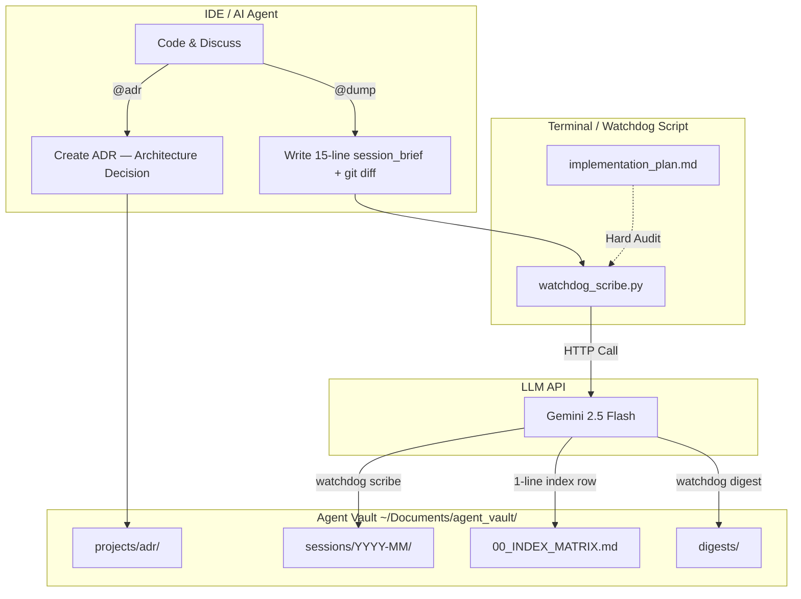

# 🛡️ Shadow Scribe

> [English](README.md) | [Tiếng Việt](README.vi.md)

> **The Execution Brain & Shadow Scribe Architecture.**  
> A perpetual Knowledge Management, Monitoring, and Audit system for AI Agents (Cursor, Windsurf, Claude Code, Antigravity).
>
> *Memory for Agents. Agents for Coding. Coding for Vibes.*
>
> **Software for agents, not for humans.** A B2A2H architecture — infrastructure serves agents, agents serve humans.

[]()
[](https://github.com/Dempty-glitch/shadow-scribe/actions/workflows/ci.yml)
[]()
[]()
[]()

---

## 🛑 The Problem — AI IDE Pain Points

Modern AI IDEs all suffer from the same two fatal diseases:

1. **Context Decay:** When a session ends, the AI forgets everything. Force-feeding old logs back to the AI burns thousands of expensive tokens (Opus/Sonnet) for nothing.
2. **Goal Drift:** The AI silently changes architecture or writes code that deviates from the original plan — without reporting it.

---

## 💡 The Solution — Shadow Scribe

**Shadow Scribe** solves this with an **Offloading Architecture**:

- **IDE Agent (e.g., Antigravity):** Focuses 100% of its Context Window on writing code. At end-of-day, it only outputs a 15-line ultra-light brief.
- **Watchdog (Python Script):** Runs externally, using **Gemini 2.5 Flash** (1M token context, Free tier) to read Git Diff, cross-check the Plan, catch bugs, and compile everything into a **perpetual Knowledge Matrix**.

---

## ✨ Key Features

- 🪶 **Zero-Dependency:** Pure Python using only stdlib (`urllib`, `json`, `pathlib`). No `pip install` needed, zero system pollution.
- 🧠 **Dual-Tier Audit:**
  - *Soft Audit:* Scans `git diff` for logic errors.
  - *Hard Audit:* Automatically finds `implementation_plan.md` by `mtime`, cross-references it against actual code to catch Goal Drift.
- 🗄️ **Persistent Knowledge Matrix:** Every session is compressed into standardized Markdown and linked in `00_INDEX_MATRIX.md`.
- 📊 **Project Digest:** Aggregates N session logs into a progress report, filtered by project and time range.
- 🔍 **Lightweight Agentic RAG:** `watchdog query` searches the vault using 2-stage retrieval — Stage 1 grep (fast, free) → Stage 2 Gemini semantic rerank (smart fallback).
- 🛡️ **Bulletproof I/O:** File overwrite protection, auto-truncation at 900K chars, `git diff HEAD~1` fallback if no staged changes.

> 💡 **Bilingual:** Session logs default to Vietnamese. Set `SHADOW_SCRIBE_LANG=en` in `~/Documents/agent_vault/.env` to switch to English. (Existing logs are not auto-translated.)

---

## 🏗️ Architecture



---

## 📸 Showcase

> **1. Catching Goal Drift with `watchdog audit`:**


> **2. Auto-generated Knowledge Matrix in `00_INDEX_MATRIX.md`:**


---

## 🚀 Quick Start (One-time Setup)

### Requirements
- Python ≥ 3.9 (stdlib only, **no pip install needed**)
- Free Gemini API Key → [Get one here](https://aistudio.google.com/)
  > ⚠️ **Security Note:** Use an official Google API Key (free/paid). **Never** use leaked, proxied, or third-party API keys — the watchdog sends your source code and session logs through that API. Using shady keys = risking project secrets.

### Install

```bash
# 1. Clone the repo
git clone https://github.com/Dempty-glitch/shadow-scribe.git
cd shadow-scribe

# 2. Run setup (creates vault, .env, alias — fully automated)
./setup.sh
```

`setup.sh` will automatically:
- ✅ Create the vault at `~/Documents/agent_vault/` (with all subdirectories)
- ✅ Prompt for your Gemini API Key → saves to `.env`
- ✅ Copy `GUIDE.md` (Agent Operations Manual) into the vault
- ✅ Add the `watchdog` alias to `.zshrc` / `.bashrc`
- ✅ Create `00_INDEX_MATRIX.md` (session index table)

### Verify

```bash
source ~/.zshrc   # or ~/.bashrc
watchdog --help
```

### Start Using

Open your IDE and send this to your Agent (Cursor, Windsurf, Claude Code, Antigravity):
```
Read the file ~/Documents/agent_vault/GUIDE.md then start working.
```
The Agent will know how to: load context at session start, `@dump` at session end, run `watchdog scribe`, etc.

---

## 🕹️ Workflow

> [!IMPORTANT]
> **Architecture Principle:** The IDE Agent (Antigravity/Cursor/Windsurf) is only an **Orchestrator** — it gathers files and runs commands.
> **Watchdog (Gemini Flash)** is the **Brain** that reads and analyzes. The Agent **NEVER** reads logs and summarizes on its own — doing so wastes expensive tokens and defeats the project's purpose.

### During Coding (Interacting with the AI IDE)
- **Lock in architecture:** Type `@adr [Issue Name]` → AI creates an Architecture Decision Record in the Vault.
- **End of day (3-in-1):** Type `@dump` → AI automatically:
  1. Writes `session_brief.md` (15 lines, including 🩸 **Blood Lessons**) to `raw_logs/{project}/`
  2. Captures `git diff` to `raw_logs/{project}/git_diff.txt`
  3. Runs `watchdog scribe` → Gemini Flash synthesizes → Log saved, raw_logs cleaned up

### Retroactive Dump (Catching up on missed days)
If you forgot to dump:
- **Have git history:** Use `git log --since="{date}"` to gather changes → write brief → run watchdog.
- **Have conversation log:** Copy chat file (`overview.txt` or chat folder) into `raw_logs/{project}/` → Watchdog (Gemini Flash 1M context) reads and synthesizes directly.
- **Quality:** Conversation logs produce **better** results than git log because they contain Blood Lessons and Decisions.
- **Cost:** ~$0.03/run (200k token input × Gemini Flash).

### Terminal Commands (Watchdog Power)

| Command | Function | Type |
| :--- | :--- | :--- |
| `watchdog audit` | **(Mid-session)** Instant Goal Drift check | 🟢 READ-ONLY |
| `watchdog audit --plan /path` | Hard Audit with explicit plan path | 🟢 READ-ONLY |
| `watchdog scribe` | **(End of day)** Gemini writes Full Log, updates Index, cleans up | 🔴 DESTRUCTIVE |
| `watchdog scribe --mock` | Dry-run: print only, no file writes | 🟢 READ-ONLY |
| `watchdog digest` | **(Weekly)** Aggregate all sessions into a report | 🟡 READ + WRITE |
| `watchdog digest --project NAME` | Filter by project (e.g., `shadow-scribe`, `z-zero`) | 🟡 READ + WRITE |
| `watchdog digest --last N` | Only last N days (e.g., `--last 30`) | 🟡 READ + WRITE |
| `watchdog query <keyword>` | **(Phase 6)** Search the vault — Stage 1 grep, Stage 2 Gemini fallback | 🟢 READ-ONLY |
| `watchdog query <keyword> --project NAME` | Filter results by project | 🟢 READ-ONLY |
| `watchdog query <keyword> --smart` | Force Stage 2 Gemini even if Stage 1 has results | 🟢 READ-ONLY |

<details>
<summary>📋 Flag details & input requirements</summary>

**`watchdog scribe` requires these files before running (v1.3.0):**
```
~/Documents/agent_vault/raw_logs/
└── {project-name}/             # ← Directory name = project name (kebab-case)
    ├── session_brief.md        # AI writes via @dump (~15 lines + 🩸 Blood Lessons)
    └── git_diff.txt            # Captured with the command below
```
```bash
# From the project directory:
mkdir -p ~/Documents/agent_vault/raw_logs/{project-name}
git diff > ~/Documents/agent_vault/raw_logs/{project-name}/git_diff.txt
# If no staged changes:
git show HEAD > ~/Documents/agent_vault/raw_logs/{project-name}/git_diff.txt
```
> 💡 Backward compat: Watchdog still reads flat `raw_logs/session_brief.md` (v1.1.0).

**`watchdog audit` auto-scans for `implementation_plan.md`:**
1. Looks in CWD (current project directory)
2. If not found → searches `.gemini/antigravity/brain/` (mtime-sort, picks latest conversation)
3. **Hard Audit** if plan found | **Soft Audit** if not

**`watchdog digest` output saved to:**
```
~/Documents/agent_vault/digests/{project}_{YYYY-MM-DD}.md
```
*(Does not overwrite same-day files — auto-appends counter `_1`, `_2`...)*

</details>

---

## 🗂️ Vault Structure (Data Taxonomy)

```
~/Documents/agent_vault/
├── 00_INDEX_MATRIX.md          # Master Index — perpetual session table
├── raw_logs/                   # Transit station (Watchdog reads then cleans)
│   └── {project-name}/         # ← v1.2.0: Each project gets its own directory
│       ├── session_brief.md    # AI writes (~15 lines + 🩸 Blood Lessons)
│       └── git_diff.txt        # git diff snapshot
├── sessions/                   # Full Session Logs (Gemini Flash synthesis)
│   └── YYYY-MM/DD_MM_YY.md
├── digests/                    # Summary reports from watchdog digest
│   └── {project}_{date}.md
├── trash/                      # ← v1.2.0: Soft-Delete — raw_logs are not permanently deleted
│   └── YYYY-MM-DD_HH-MM-SS/   # Timestamped slots for easy recovery
│       └── {project-name}/
├── artifacts/                  # Draft files, schemas, migrations from sessions
│   └── YYYY-MM/
└── projects/
    └── {project_name}/
        ├── PROJECT_INDEX.md    # Timeline + Key Decisions + Roadmap
        └── adr/                # Architecture Decision Records (Project Constitution)
```

---

## ⚙️ Configuration

| Variable | Default | Description |
|----------|---------|-------------|
| `GEMINI_API_KEY` | *(required)* | Google AI API Key — [get free here](https://aistudio.google.com/). Stored at `~/Documents/agent_vault/.env` |
| `SHADOW_SCRIBE_LANG` | `vi` | Language for Gemini-generated content (`vi` or `en`). Affects session logs, audit reports, digests, and query rerank. |
| `GEMINI_MODEL` | `gemini-2.5-flash` | Model used for scribe + audit + digest + query. Allowlist: `gemini-2.5-flash`, `gemini-2.5-pro`. Unknown values are rejected. |
| `SHADOW_SCRIBE_VAULT_DIR` | `~/Documents/agent_vault/` | Vault root directory. ⚠️ **Shell-level only** — must be `export`ed before running watchdog. Cannot be set via `.env` (chicken-and-egg: `.env` lives inside the vault). |

> 💡 **Tip:** No need to export environment variables. Watchdog auto-reads `~/Documents/agent_vault/.env`.  
> 💡 **Self-Cleaning:** The `trash/` directory auto-purges files older than 30 days on every watchdog run.

---

## 🗺️ Roadmap

- [x] **Phase 1 & 2:** `@dump` / `@adr` protocol and basic Vault structure.
- [x] **Phase 3.1:** `watchdog audit` — Dual-Tier Audit (Hard + Soft), read-only.
- [x] **Phase 3.2:** `watchdog digest` — Project-filtered summary, dual output.
- [x] **Phase 3.3:** Bulletproof Scribe — 🩸 Blood Lessons, Directory Routing, Soft-Delete, Auto-Cleanup, Env Loader (v1.2.0)
- [x] **Phase 3.4:** Security Hardening — Secrets Redact, XML Escape, Atomic Write, HTTP Retry, Diff Filter (v1.2.1)
- [x] **Phase 3.5:** Package Refactor, CI/CD Pipeline & 3-Layer JSON Parser (v1.2.2)
- [x] **Phase 6:** `watchdog query` — Lightweight Agentic RAG (Parent-Child + Sparse-LLM Hybrid Reranking) (v1.3.0)
- [x] **Phase 3.6:** i18n — ENV-based bilingual output (`SHADOW_SCRIBE_LANG=vi|en`) for all 4 modes (v1.3.1)
- [ ] **Phase 4:** Telegram Bot integration — receive Goal Drift alerts on your phone. *(pending — awaiting stability)*
- [ ] **Phase 5:** ~~Internal Monologue~~ → **dropped**: belongs in the skill layer (agent-side), not in Shadow Scribe (independent auditor).

---

## 📚 Related Documentation

- [ROADMAP.md](ROADMAP.md) — Detailed phase history & future plans
- [ADR Index](docs/adr/ADR_INDEX.md) — Architecture Decision Records (7 ADRs)

---

*Built with rigorous engineering discipline. Shadow Scribe doesn't do the work for you — it ensures you and your AI never go off course.*
