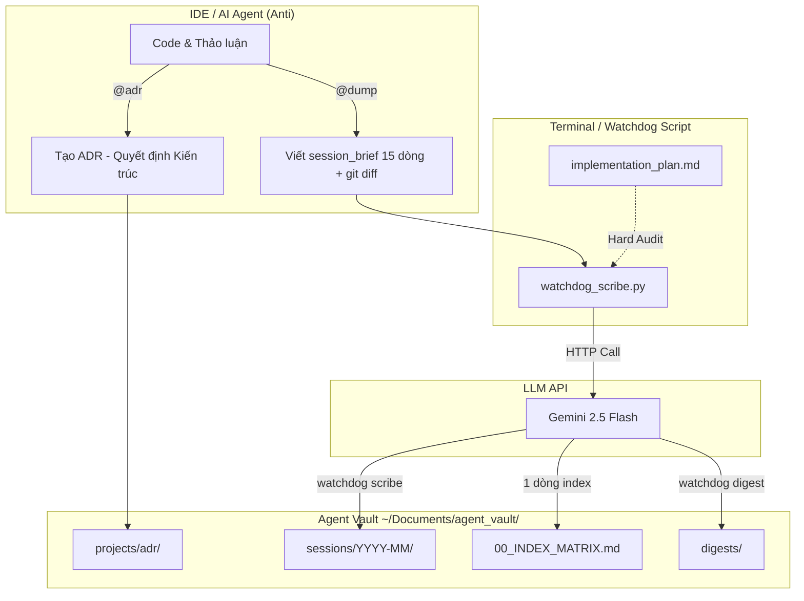
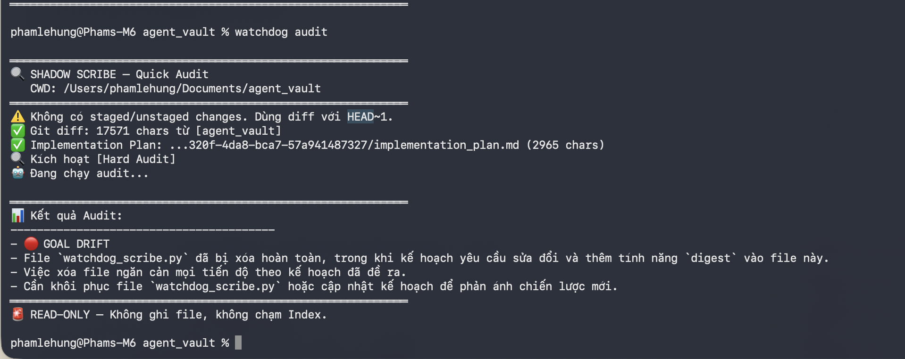
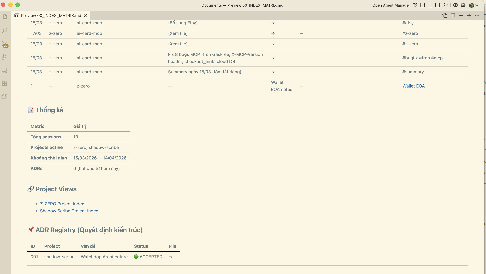

# 🛡️ Shadow Scribe

> **The Execution Brain & Shadow Scribe Architecture.**  
> Hệ thống Quản trị Tri thức, Giám sát và Kiểm toán (Audit) vĩnh cửu dành cho AI Agents (Cursor, Windsurf, Antigravity).

[]()
[](https://github.com/Dempty-glitch/shadow-scribe/actions/workflows/ci.yml)
[]()
[]()
[]()

---

## 🛑 Nỗi đau của AI IDEs (The Problem)

Các AI IDE hiện nay đều mắc chung 2 căn bệnh chí mạng:

1. **Mất trí nhớ (Context Decay):** Khi kết thúc phiên làm việc, AI quên sạch bối cảnh. Bắt AI đọc lại log cũ sẽ đốt hàng ngàn token đắt đỏ (Opus/Sonnet) một cách vô ích.
2. **Lệch hướng mục tiêu (Goal Drift):** AI tự ý thay đổi kiến trúc hoặc code sai lệch so với kế hoạch ban đầu mà không báo cáo.

---

## 💡 Giải pháp: Shadow Scribe (The Solution)

**Shadow Scribe** giải quyết triệt để vấn đề này bằng kiến trúc **Offloading (Chuyển giá)**:

- **IDE Agent (Anti):** Chỉ tập trung 100% Context Window vào việc gõ code. Cuối ngày chỉ nhả ra 15 dòng tóm tắt siêu nhẹ.
- **Watchdog (Python Script):** Chạy ngầm bên ngoài, sử dụng **Gemini 2.5 Flash** (1 Triệu token context, Free tier) để đọc Git Diff, đối chiếu Kế hoạch, soi lỗi, và tổng hợp thành một **Ma trận Tri thức (Knowledge Matrix)** vĩnh cửu.

---

## ✨ Tính năng nổi bật (Key Features)

- 🪶 **Zero-Dependency:** Script Python viết bằng 100% thư viện chuẩn (`urllib`, `json`, `pathlib`). Không cần `pip install`, không rác hệ thống.
- 🧠 **Dual-Tier Audit (Kiểm toán Kép):**
  - *Soft Audit:* Quét `git diff` để tìm lỗi logic.
  - *Hard Audit:* Tự động tìm `implementation_plan.md` theo `mtime`, đối chiếu chéo với code thực tế để bắt quả tang AI "lươn lẹo" (Goal Drift).
- 🗄️ **Persistent Knowledge Matrix:** Mọi phiên làm việc được nén thành Markdown chuẩn và liên kết trong `00_INDEX_MATRIX.md`.
- 📊 **Project Digest:** Tổng hợp N session logs thành báo cáo tiến độ, filter theo project và khoảng thời gian.
- 🛡️ **Bulletproof I/O:** Chống ghi đè file, tự truncate nếu vượt 900K chars, tự fallback `git diff HEAD~1` nếu không có staged changes.

---

## 🏗️ Sơ đồ Kiến trúc (Architecture)



---

## 📸 Showcase

> **1. Bắt quả tang Goal Drift bằng `watchdog audit`:**



> **2. Ma trận Tri thức tự động sinh ra trong `00_INDEX_MATRIX.md`:**



---

## 🚀 Cài đặt (Quick Start — Làm 1 lần duy nhất)

### Yêu cầu
- Python ≥ 3.9 (chỉ dùng thư viện chuẩn, **không cần pip install**)
- Gemini API Key miễn phí → [Lấy tại đây](https://aistudio.google.com/)
  > ⚠️ **Lưu ý bảo mật:** Hãy dùng API Key chính hãng từ Google (miễn phí/giá rẻ). **Tuyệt đối KHÔNG** dùng các API Key trôi nổi, proxy hoặc dịch vụ bên thứ 3 ẩn danh, vì watchdog sẽ gửi toàn bộ source code và nhật ký làm việc của bạn qua API đó. Dùng hàng trôi nổi = nguy cơ lộ bí mật dự án.

### Cài đặt

```bash
# 1. Clone repo
git clone https://github.com/Dempty-glitch/shadow-scribe.git
cd shadow-scribe

# 2. Chạy setup (tạo vault, .env, alias — tất cả tự động)
./setup.sh
```

Script `setup.sh` sẽ tự động:
- ✅ Tạo vault tại `~/Documents/agent_vault/` (với đầy đủ thư mục con)
- ✅ Hỏi bạn nhập Gemini API Key → lưu vào `.env`
- ✅ Copy `GUIDE.md` (sổ tay cho Agent) vào vault
- ✅ Thêm alias `watchdog` vào `.zshrc` / `.bashrc`
- ✅ Tạo `00_INDEX_MATRIX.md` (bảng mục lục sessions)

### Kiểm tra

```bash
source ~/.zshrc   # hoặc ~/.bashrc
watchdog --help
```

### Bắt đầu sử dụng

Mở IDE và gửi cho Agent của bạn (Cursor, Windsurf, Claude Code, Antigravity):
```
Đọc file ~/Documents/agent_vault/GUIDE.md rồi bắt đầu làm việc.
```
Agent sẽ tự biết cách: nạp context đầu phiên, `@dump` cuối phiên, chạy `watchdog scribe`, v.v.

---

## 🕹️ Hướng dẫn sử dụng (Workflow)

> [!IMPORTANT]
> **Nguyên tắc kiến trúc:** Agent IDE (Antigravity/Cursor/Windsurf) chỉ là **Điều phối viên** — gom file, chạy lệnh.
> **Watchdog (Gemini Flash)** mới là **Bộ não** đọc và phân tích. Agent **KHÔNG BAO GIỜ** tự đọc rồi tổng hợp — làm vậy tốn token đắt đỏ và mất ý nghĩa gốc của dự án.

### Trong lúc Code (Giao tiếp với AI IDE)
- **Chốt kiến trúc:** Gõ `@adr [Tên vấn đề]` → AI tạo ngay "Bản đồ đường sống/đường chết" lưu vào Vault.
- **Kết thúc ngày (3-in-1):** Gõ `@dump` → AI tự động làm 3 việc:
  1. Viết `session_brief.md` (15 dòng, bao gồm mục 🩸 **Blood Lessons**) vào `raw_logs/{project}/`
  2. Chụp `git diff` vào `raw_logs/{project}/git_diff.txt`
  3. Tự gọi `watchdog scribe` → Gemini Flash tổng hợp → Log được lưu, raw_logs dọn sạch

### Retroactive Dump (Dump bù cho ngày đã quên)
Nếu quên dump, Agent IDE vẫn có thể dump bù bằng cách:
- **Có git history:** Dùng `git log --since="{ngày}"` để gom code changes → viết brief → chạy watchdog.
- **Có conversation log:** Copy file chat (`overview.txt` hoặc folder chat) vào `raw_logs/{project}/` → Watchdog (Gemini Flash 1M context) đọc trực tiếp và tổng hợp.
- **Chất lượng:** Conversation log cho kết quả **tốt hơn** git log vì có cả Blood Lessons và Decisions.
- **Chi phí:** ~$0.03/lần (200k token input × Gemini Flash).

### Trên Terminal (Sức mạnh của Watchdog)

| Lệnh | Chức năng | Loại |
| :--- | :--- | :--- |
| `watchdog audit` | **(Dùng giữa giờ)** Soi Goal Drift ngay lập tức | 🟢 READ-ONLY |
| `watchdog audit --plan /path` | Hard Audit với plan chỉ định rõ | 🟢 READ-ONLY |
| `watchdog scribe` | **(Dùng cuối ngày)** Gọi Gemini viết Full Log, cập nhật Index, dọn rác | 🔴 DESTRUCTIVE |
| `watchdog scribe --mock` | Dry-run: chỉ print, không ghi file | 🟢 READ-ONLY |
| `watchdog digest` | **(Dùng cuối tuần)** Tổng hợp tất cả sessions thành báo cáo | 🟡 READ + WRITE |
| `watchdog digest --project NAME` | Filter theo project (vd: `shadow-scribe`, `z-zero`) | 🟡 READ + WRITE |
| `watchdog digest --last N` | Chỉ lấy N ngày gần nhất (vd: `--last 30`) | 🟡 READ + WRITE |

<details>
<summary>📋 Chi tiết flags & input requirements</summary>

**`watchdog scribe` cần có trước khi chạy (v1.3.0):**
```
~/Documents/agent_vault/raw_logs/
└── {project-name}/             # ⬅️ Tên thư mục = tên project (kebab-case)
    ├── session_brief.md        # AI viết qua @dump (~15 dòng + 🩸 Blood Lessons)
    └── git_diff.txt            # Chụp bằng lệnh bên dưới
```
```bash
# Từ thư mục project:
mkdir -p ~/Documents/agent_vault/raw_logs/{project-name}
git diff > ~/Documents/agent_vault/raw_logs/{project-name}/git_diff.txt
# Nếu không có staged changes:
git show HEAD > ~/Documents/agent_vault/raw_logs/{project-name}/git_diff.txt
```
> 💡 Backward compat: Watchdog vẫn đọc được flat `raw_logs/session_brief.md` (v1.1.0).

**`watchdog audit` auto-scan `implementation_plan.md`:**
1. Tìm trong CWD (thư mục project hiện tại)
2. Nếu không có → tìm trong `.gemini/antigravity/brain/` (mtime-sort, lấy conversation mới nhất)
3. **Hard Audit** nếu tìm thấy plan | **Soft Audit** nếu không có

**Output `watchdog digest` lưu tại:**
```
~/Documents/agent_vault/digests/{project}_{YYYY-MM-DD}.md
```
*(Không ghi đè file cũ cùng ngày — tự thêm counter `_1`, `_2`...)*

</details>

---

## 🗂️ Cấu trúc Vault (Data Taxonomy)

```
~/Documents/agent_vault/
├── 00_INDEX_MATRIX.md          # Master Index — Bảng mục lục vĩnh cửu
├── raw_logs/                   # Trạm trung chuyển (Watchdog đọc xong sẽ dọn)
│   └── {project-name}/         # ⬅️ v1.2.0: Mỗi project 1 thư mục riêng
│       ├── session_brief.md    # AI viết (~15 dòng + 🩸 Blood Lessons)
│       └── git_diff.txt        # git diff snapshot
├── sessions/                   # Full Session Logs (Gemini Flash tổng hợp)
│   └── YYYY-MM/DD_MM_YY.md
├── digests/                    # Báo cáo tổng hợp từ watchdog digest
│   └── {project}_{date}.md
├── trash/                      # ⬅️ v1.2.0: Soft-Delete — raw_logs không xóa vĩnh viễn
│   └── YYYY-MM-DD_HH-MM-SS/   # Slot theo timestamp, phục hồi dễ dàng
│       └── {project-name}/
├── artifacts/                  # File nháp, schema, migration gom từ các phiên
│   └── YYYY-MM/
└── projects/
    └── {project_name}/
        ├── PROJECT_INDEX.md    # Timeline + Key Decisions + Roadmap
        └── adr/                # Architecture Decision Records (Hiến pháp dự án)
```

---

## ⚙️ Config

| Biến | Mặc định | Mô tả |
|------|----------|-------|
| `GEMINI_API_KEY` | *(required)* | Google AI API Key — [lấy miễn phí tại đây](https://aistudio.google.com/). Lưu tại `~/Documents/agent_vault/.env` |
| `SHADOW_SCRIBE_LANG` | `vi` | Ngôn ngữ output của Gemini (`vi` hoặc `en`). Áp dụng cho session logs, audit, digest, và query. |
| `GEMINI_MODEL` | `gemini-2.5-flash` | Model dùng cho scribe + audit + digest + query. Allowlist: `gemini-2.5-flash`, `gemini-2.5-pro`. Giá trị lạ bị từ chối. |
| `SHADOW_SCRIBE_VAULT_DIR` | `~/Documents/agent_vault/` | Root của vault. ⚠️ **Chỉ set ở shell** — phải `export` trước khi chạy watchdog. Không thể đặt trong `.env` (vì `.env` nằm bên trong vault). |

> 💡 **Mẹo:** Bạn không cần export biến môi trường. Watchdog sẽ tự đọc file `~/Documents/agent_vault/.env`.
> 💡 **Self-Cleaning:** Thư mục `trash/` sẽ tự động dọn các file cũ hơn 30 ngày mỗi lần bạn chạy watchdog.

---

## 🗺️ Roadmap (V1.2+ & V2.0)

- [x] **Phase 1 & 2:** Giao thức `@dump`, `@adr` và Cấu trúc Vault cơ bản.
- [x] **Phase 3.1:** `watchdog audit` — Dual-Tier Audit (Hard + Soft), read-only.
- [x] **Phase 3.2:** `watchdog digest` — Project-filtered summary, dual output.
- [x] **Phase 3.3:** Bulletproof Scribe — 🩸 Blood Lessons, Directory Routing, Soft-Delete, Auto-Cleanup, Env Loader (v1.2.0)
- [x] **Phase 3.4:** Security Hardening — Secrets Redact, XML Escape, Atomic Write, HTTP Retry, Diff Filter (v1.2.1)
- [x] **Phase 3.5:** Package Refactor, CI/CD Pipeline & 3-Layer JSON Parser (v1.2.2)
- [x] **Phase 6:** `watchdog query` — Lightweight Agentic RAG (Parent-Child + Sparse-LLM Hybrid Reranking) (v1.3.0)
- [x] **Phase 3.6:** i18n — Chuyển đổi ngôn ngữ output qua ENV (`SHADOW_SCRIBE_LANG=vi|en`) cho cả 4 mode (v1.3.1)
- [ ] **Phase 4:** Tích hợp Telegram Bot — nhận cảnh báo Goal Drift qua điện thoại. *(pending — đợi stability)*
- [ ] **Phase 5:** ~~Internal Monologue~~ → **dropped**: thuộc skill layer (agent-side), không phải Shadow Scribe (audit độc lập).

---

## 📚 Tài liệu liên quan

- [ROADMAP.md](ROADMAP.md) — Chi tiết phases đã xong & kế hoạch
- [ADR Index](docs/adr/ADR_INDEX.md) — Quyết định kiến trúc (7 ADRs)

---

*Được thiết kế với kỷ luật kỹ thuật khắt khe. Shadow Scribe không làm thay bạn — nó giúp bạn và AI không bao giờ đi lạc.*
